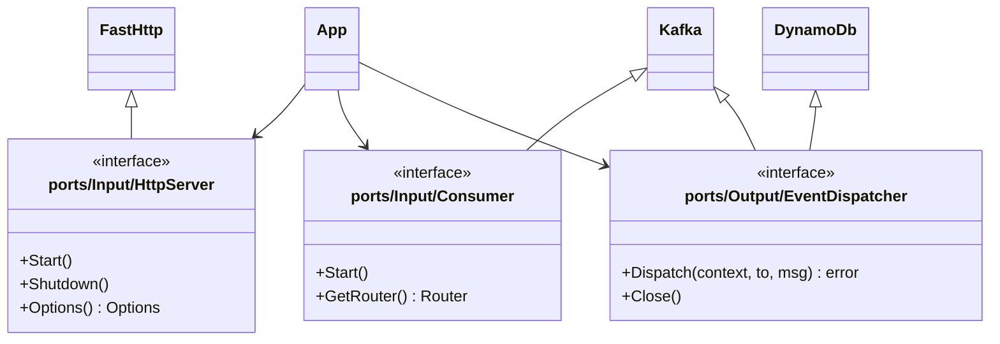

# Meli URL Shortener

### How to Up

```bash
cp .env.example .env

docker compose up -d

bash docs/dynamo-db/init.sh
```

### Documentation

After run, PUT one URL into http://localhost:8080

```bash
curl --request POST \
  --url http://localhost:8080/ \
  --header 'Content-Type: multipart/form-data' \
  --form url=https://www.mercadolivre.com.br/
```

### Hexagonal Diagram




### Pending Features

 - [ ] Short URL Redirect
 - [ ] Short URL Delete
 - [ ] Short URL Stats
 - [ ] Deployment
 - [ ] API Documentation
 - [ ] Swagger UI
 - [ ] Tests

### Issues

 - [ ] Worker Container not working because AWS Credentials cache problems
 - [ ] Add tests
 - [ ] Add README.md

