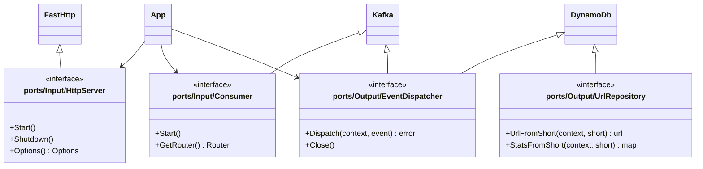

# URL Shortener

### How to Up

```bash
cp .env.example .env

docker compose up -d

bash docs/dynamo-db/init.sh
```

### Documentation

After run, POST your complete URL into http://localhost:8080

```bash
# CREATE SHORT URL
curl --request POST \
  --url http://localhost:8080/ \
  --header 'Content-Type: multipart/form-data' \
  --form url=https://www.mercadolivre.com.br/

# REDIRECT SHORT URL To YOUR URL
curl --request GET \
  --url http://localhost:8080/{short}

# GET STATS
curl --request GET \
  --url http://localhost:8080/{short}/stats

# DELETE SHORT URL
curl --request DELETE \
  --url http://localhost:8080/{short}
```

### Hexagonal Diagram




### Pending Features

 - [ ] Deployment
 - [ ] Complete Documentation
 - [ ] Swagger UI
 - [ ] Tests

### Issues

 - [ ] Worker Container not working because AWS Credentials cache problems
